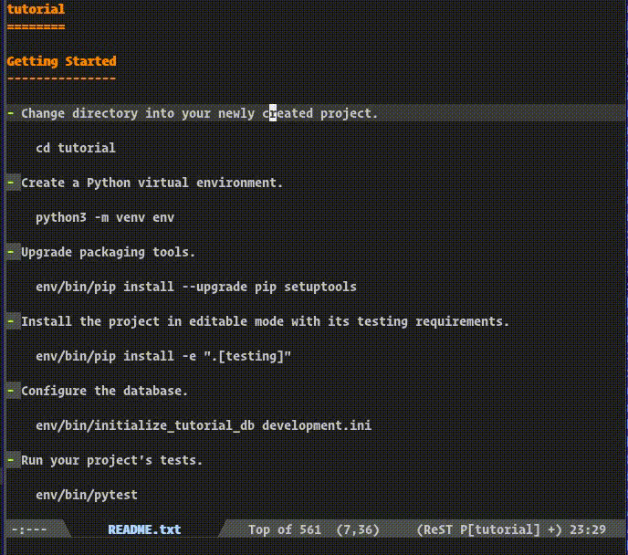
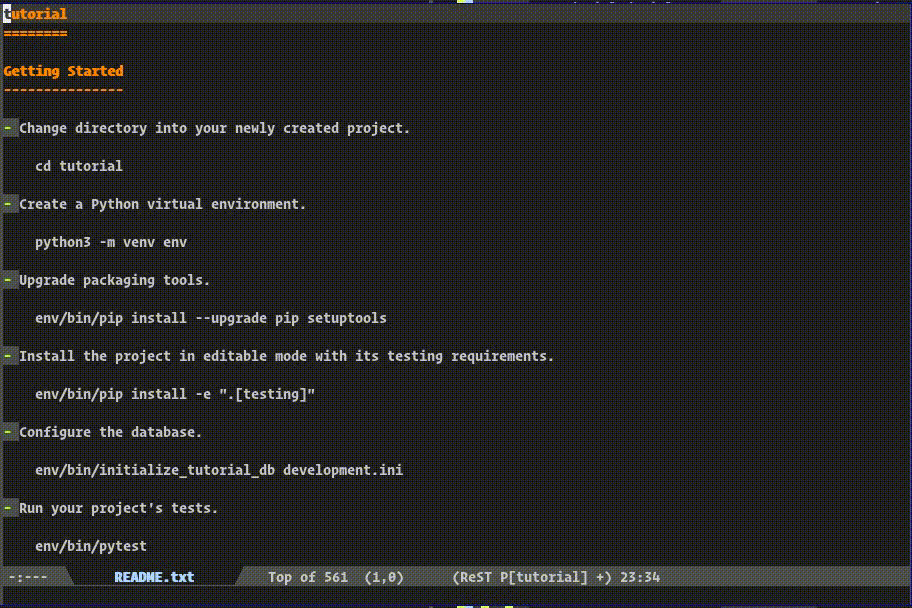

# Emacs minor mode for Pyramid

This package provides utilities for working with the python
web framework [pyramid](https://trypyramid.com/).

## Features

* Wrapper functions around the pyramid builtin p* scripts
  - pyramid-routes
  - pyramid-views
  - pyramid-tweens
  - pyramid-request
  - pyramid-distreport
  - pyramid-serve
* Easily locate and jump to all your "pyramid things"
  - View definitions
  - Templates
  - Sqlalchemy models
  - Console scripts
  - Settings
* Function to create a new pyramid project from cookiecutter templates
* Run console scripts defined in your project
* Add yasnippets for common pyramid tasks

## Screenshots

Use navigation features of `pyramid-mode` on a fresh
tutorial project from the pyramid docs.
- Find view
- Find template
- Find sqlalchemy model
- Find settings

Show pyramid p*-script functions of `pyramid-mode`.
- Show proutes (in tabulated list and jump to view)
- Call ptweens
- Select and call user console script
- Call pserver

## Configuration

See the `pyramid` customization group for settings:
`M-x customize-group RET pyramid`

To turn on `pyramid-mode` in all buffers that are pyramid projects
use `global-pyramid-mode`.
To detect if a file belongs to a pyramid project it's parent
directories are searched for a file specified in the
`pyramid-settings` variable which defaults to "development.ini".

For some actions (like getting a list of console_scripts and
sqlalchemy models) `pyramid.el` needs to know the package name
of the pyramid project so it can import modules from it.
This is done by calling `pyramid.paster.bootstrap` which could be
slow in some cases. To prevent this expensive call you can
set the package name yourself with `pyramid-package-name`.

## Usage

If you open file or directory related to the project, you should see
`Pyramid` minor mode is activated for this buffer.  Note, you should
open project files over tramp method, if you use remote interpreter.
For example, open `/docker:root@container:/code/views.py` instead of
`views.py` on the local host.

### Project navigation

`pyramid-keymap-prefix` + uppercase letter is for
the pyramid p... scripts like `pserve`, `proutes` etc.

`pyramid-keymap-prefix` + `!` lets you select and run
one of your personal scripts defined in your setup.py
`console_scripts` entry point.

`pyramid-keymap-prefix` + lowercase letter is for
navigation to quickly select and jump to
views, templates, sqlalchemy models, etc.

| Key                | Command                       |
|--------------------|-------------------------------|
| <kbd>C-c ' D</kbd> | pyramid-distreport            |
| <kbd>C-c ' R</kbd> | pyramid-routes                |
| <kbd>C-c ' S</kbd> | pyramid-serve                 |
| <kbd>C-c ' T</kbd> | pyramid-tweens                |
| <kbd>C-c ' V</kbd> | pyramid-views                 |
| <kbd>C-c ' X</kbd> | pyramid-request               |
| <kbd>C-c ' !</kbd> | pyramid-run-console-script    |
| <kbd>C-c ' c</kbd> | pyramid-find-console-script   |
| <kbd>C-c ' m</kbd> | pyramid-find-sqlalchemy-model |
| <kbd>C-c ' s</kbd> | pyramid-find-settings         |
| <kbd>C-c ' t</kbd> | pyramid-find-template         |
| <kbd>C-c ' v</kbd> | pyramid-find-view             |

## Thanks

This package is inspired by and uses code from [djangonaut](https://github.com/proofit404/djangonaut).
Check it out if you need a similar package for django.
